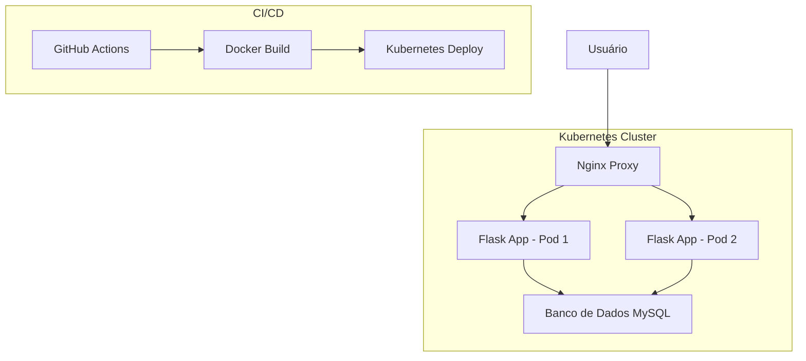

# Diagrama de Arquitetura do Projeto DevOps

## Descrição da Arquitetura

### Componentes
1. **Nginx**: Proxy reverso para balanceamento de carga
2. **Flask App**: Aplicação web em contêineres
3. **MySQL**: Banco de dados persistente
4. **Kubernetes**: Orquestração de contêineres
5. **GitHub Actions**: Pipeline de CI/CD

### Fluxo de Dados
- Usuário acessa através do Nginx
- Nginx distribui requisições para pods do Flask
- Pods do Flask se comunicam com banco de dados MySQL
- GitHub Actions automatiza build e deploy
